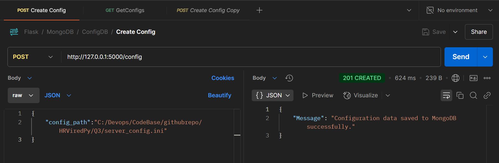
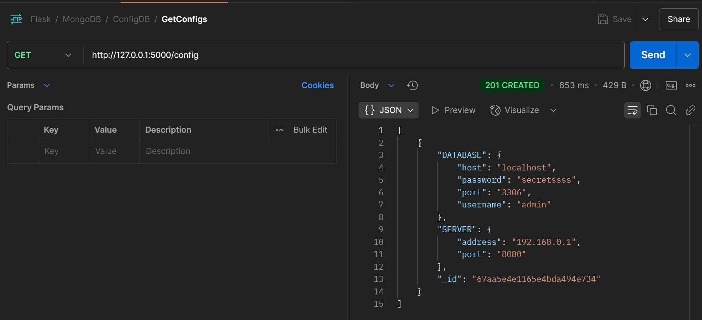
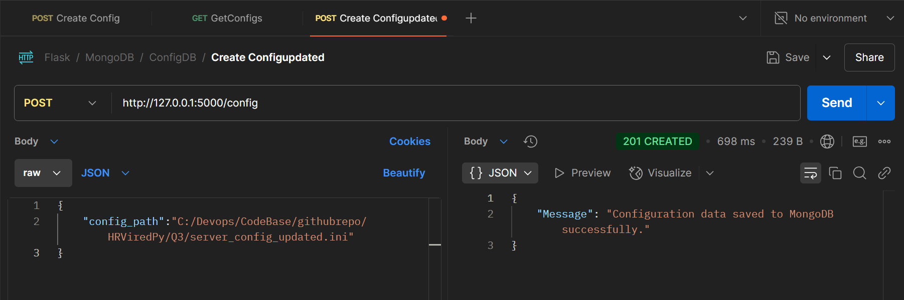
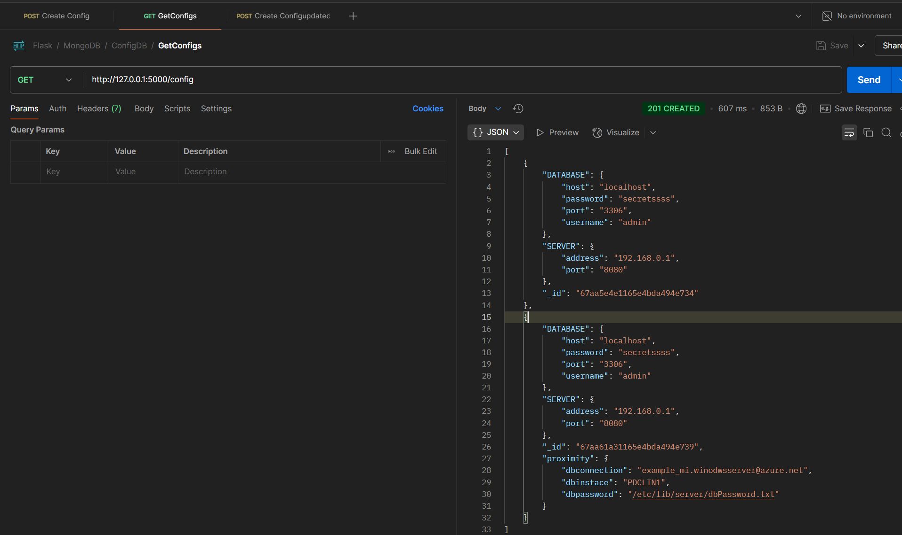

# Test scenarios using PostMan
## Collection is empty 

## Test results-postman 

## Providing config file as per the use case
Test results-postman [POST] request/response

## Test resulsts-postman [GET] request/response

##  Test results - postman-2
Test results-postman [POST] request/response

## Test resulsts-postman [GET] request/response

